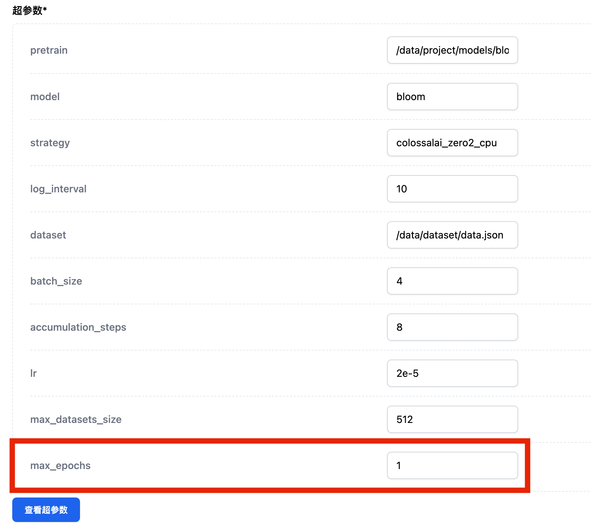

# 命令行工具

## 简介

为了方便用户一键创建符合云平台要求的项目，我们提供了一个命令行工具名叫cap，它的名字来源于Colossal-AI Platform的首字母。

## 安装

1. 从源码安装

```bash
pip install git+https://github.com/hpcaitech/ColossalAI-Platform-CLI@main
```

1. 从PyPI安装

```bash
pip install colossalai-platform
```

## 使用方法

### 创建一个标准项目

我们可以用下面的命令创建一个标准的项目结构，记得替换`<project-name>`为你自己的项目名称。

```bash
cap project init <project-name>
```

这个项目将包含以下文件

```
- <project name>
    - Dockerfile
    - train.sh
    - train.py
    - HyperParameters.json
    - README.md
    - requirements.txt
```

`train.sh`,`train.py`,`HyperParameters.json`为云平台启动任务时的必要文件。

**1. HyperParameters.json**

这个文件定义了用户启动训练任务时所需要输入的超参数，用户可以通过在json里添加自己的超参数定义。

```
{
  "HyperParameters": [
    {
      "name": "max_epoch",
      "types": "int",
      "defaultValue": "10",
      "description" : ""
    }
  ]
}
```
在启动任务时，就能看到这个超参了。



**2. train.py**

`train.py`里包含了主要的训练代码。

**3. train.sh**

`train.sh`是整个项目的主要入口，云平台会执行这个文件来启动训练。
